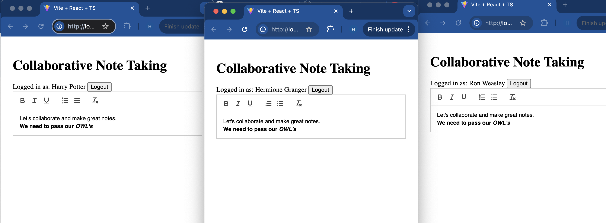
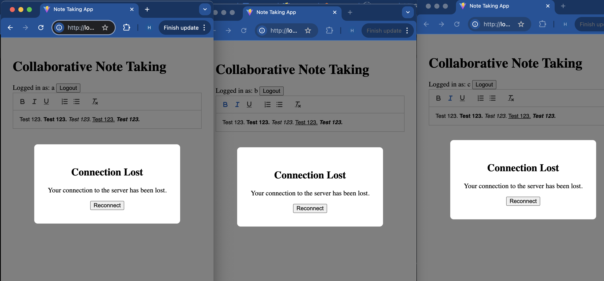

# Collaborative Note-Taking Application

## Project Overview

A real-time collaborative note-taking application that enables multiple users to simultaneously edit and format text with live updates. The application features a WYSIWYG editor, real-time synchronization through WebSockets, and basic user authentication.

## Technology Stack

- **Frontend**:

  - React with TypeScript
  - QuillJS for WYSIWYG editing
  - Socket.io-client for real-time communication
  - React Context for state management

- **Backend**:
  - Node.js with Express
  - Socket.io for WebSocket server
  - In-memory data store

## Features Implemented

- Real-time collaborative text editing
- Rich text formatting (bold, italic, underline, etc.)
- Basic user authentication
- Live preview of formatted text
- Connection status monitoring with reconnection capability
- Multi-user synchronization
- Persistent user sessions

## Setup Instructions

1. Clone the repository:

```bash
git clone https://github.com/H-Khan-14/proposify-takehome.git
```

2. Install backend dependencies:

```bash
npm install
```

3. Install frontend dependencies:

```bash
cd src/client
npm install
```

4. Start the development servers:

Backend (from root directory):

```bash
npm run dev
```

Frontend (from src/client directory):

```bash
npm run dev
```

The application will be available at:

- Frontend: http://localhost:5173
- Backend: http://localhost:3005

## Usage

1. Open multiple tabs or browsers and navigate to http://localhost:5173 on each one.
2. Log in with basic user credentials to access the editor.
3. As you make changes in the WYSIWYG editor in one tab, the updates will appear live in all other open tabs.
4. The app uses WebSocket connections to synchronize data in real-time.

## Screenshots

Collaborative Note-Taking in Action


Disconnect Modal


## Future Improvements

1. **Enhanced Authentication**

   - Implement proper user authentication with JWT
   - Add user roles and permissions
   - Ex. Leverage Firebase authentication or AWS cognito

2. **Data Persistence**

   - Integrate a proper database (MongoDB/PostgreSQL)
   - Leverage ORM such as Sequelize
   - Add document history and versioning

3. **Enhanced Collaboration Features**

   - User cursors and presence indicators
   - Comments and annotations
   - Document sharing controls

4. **Performance Optimizations**

   - Add conflict resolution
   - Optimize WebSocket payload size

5. **UI/UX Improvements**
   - Add loading states
   - Implement error boundaries
   - Add CSS to create a sleek modern design
   - Ex. Use framework such as Material UI or Tailwind CSS
